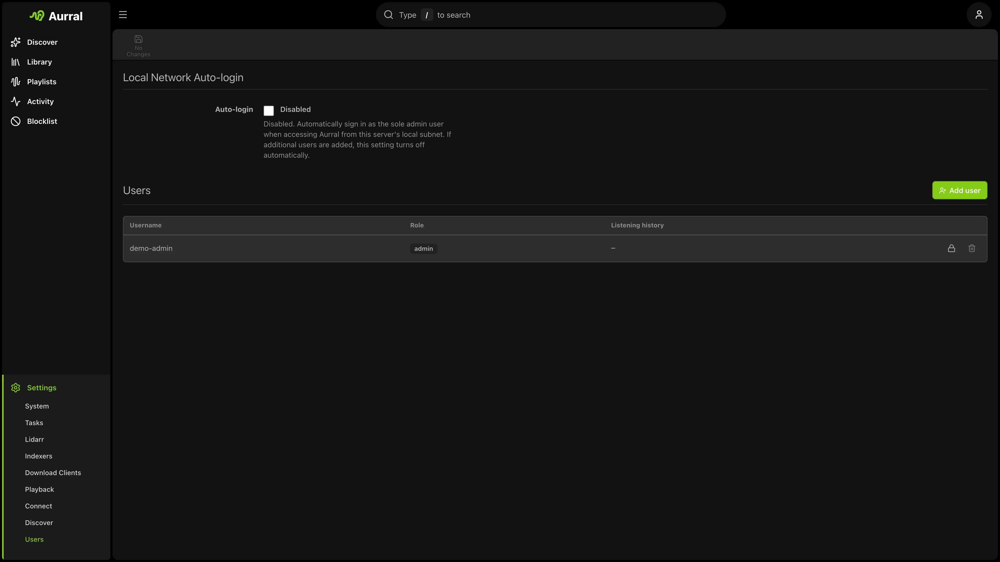

Aurral supports multiple local users with granular permissions.



## Permissions

Admins can control whether users can:

- Access playlists and flows
- Add artists or albums
- Change monitoring
- Delete artists or albums

## Authentication

- Local username and password accounts
- Optional local-network auto-login for single-admin home setups
- Reverse-proxy authentication for SSO

## Reverse-proxy auth

Set `AUTH_PROXY_ENABLED=true` or provide `AUTH_PROXY_HEADER` to let a trusted reverse proxy authenticate users before requests reach Aurral.

The default username header is `x-forwarded-user`.

When a proxied username first reaches Aurral, Aurral creates a matching local user. The user role comes from one of these sources:

- `AUTH_PROXY_DEFAULT_ROLE` - the default for anyone not otherwise granted admin
- An exact match in `AUTH_PROXY_ADMIN_USERS`
- Group membership from `AUTH_PROXY_ROLE_HEADER` (for example, Authelia's `Remote-Groups`), compared with `AUTH_PROXY_ADMIN_GROUPS`

Aurral evaluates the role on every request. Thus, a proxy or identity-provider role change takes effect on the next request.
You do not have to edit the account in Aurral.

Set `AUTH_PROXY_TRUSTED_IPS` to your reverse proxy's address. Without it, Aurral accepts identity headers from any client that can reach Aurral.

For Authelia or similar forwardAuth, set `AUTH_PROXY_DOMAIN` to the login origin. When a session expires, Aurral navigates to `/api/auth/reauth` so the proxy can show its login page, then returns the user to Aurral's home page.

For Authentik, route `/outpost.goauthentik.io` directly to the Authentik outpost and do not protect that location with `auth_request`. Verify it before testing Aurral:

```bash
curl -i https://aurral.example.com/outpost.goauthentik.io/ping
```

The response must be `204`. To make Aurral's **Log out** action end the Authentik session too, set `AUTH_PROXY_LOGOUT_URL=https://aurral.example.com/outpost.goauthentik.io/sign_out`.

Proxy-created users cannot use local password login until an admin sets a password. After creation, admins can manage the account from **Settings → Users**.

## Reset admin password

From the repository root:

```bash
npm run auth:reset-admin-password -- --password "new-password"
```

Generate a random password:

```bash
npm run auth:reset-admin-password -- --generate
```
