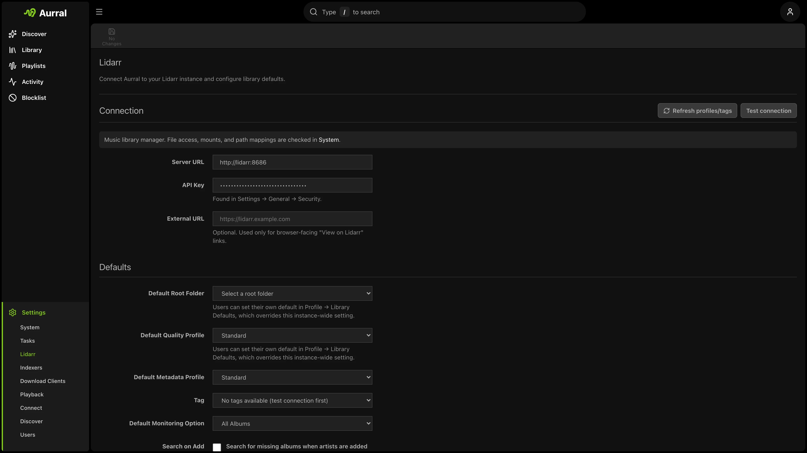

First, create your admin account. Then, connect Lidarr.

Use Settings for all other setup tasks.

## First-run steps

1. Create your admin account.
2. If necessary, enable **Auto-login on local network**.
3. Enter the Lidarr URL and API key.
4. Test the Lidarr connection.
5. Open Aurral.

If Lidarr is operational, match its media mount. See [Match Lidarr](/getting-started/storage/).

## After first-run setup

Configure these in Settings when you need them:

- **Settings > Download Clients > Downloads Folder**: path under your Lidarr media root (for example `/data/downloads/aurral`).
- **Settings > Lidarr**: quality profile, monitoring, community guide, library access check.
- **Settings > Download Clients** or **Indexers**: yt-dlp, slskd, Prowlarr, SABnzbd, or NZBGet.
- **Settings > Playback**: Navidrome or Plex.
- **Settings > Connect**: Last.fm API key and Ticketmaster.
- **Settings > Discover**: recommendation refresh and discovery mode.
- **Profile**: listening-history provider (ListenBrainz by default until you add Last.fm or Koito).

## Per-user setup

Each user can customize their Profile. Each user can also customize the Discover layout.

Admins use Settings to manage integrations, download clients, notifications, and user permissions.

Next: [Discover](/using/discover/)
