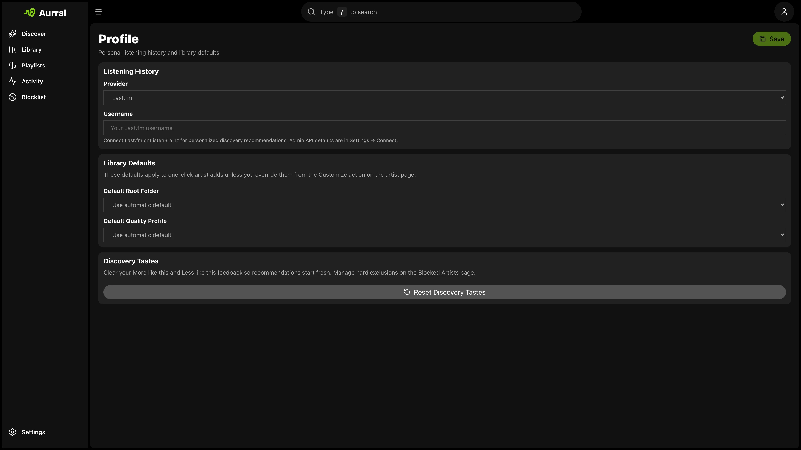

You can use Aurral without Last.fm. However, a Last.fm API key improves recommendations, tags, and discover playlists.

## Server setup

Add your Last.fm API key in **Settings → Connect → Last.fm**.

## Per-user listening history

Each user sets their own Last.fm username in **Profile**. On a shared Aurral instance, this keeps recommendations personal.

## Discovery settings

Admins configure refresh cadence and discovery mode (Safer, Balanced, or Deeper) in **Settings → Discover**.

If Last.fm is unavailable, Aurral can use ListenBrainz or [Koito](/integrations/koito/) listening history when users have them configured.
