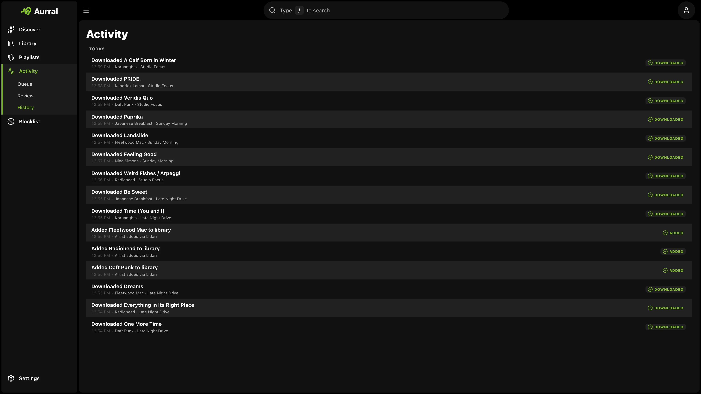

slskd downloads flow and playlist tracks from Soulseek. Aurral can also use [Usenet](/integrations/usenet/) through Prowlarr and SABnzbd/NZBGet.

## Setup

1. If Lidarr uses slskd on a shared `/data` mount, give Aurral that same mount ([Match Lidarr](/getting-started/storage/)).
2. Connect slskd in **Settings > Download Clients > slskd**.

Aurral moves completed files from slskd into your Downloads Folder path.

If slskd runs on Windows and reports host paths, mount the parent folder into Aurral. For example, slskd can report `N:\...`.

Then, add a path mapping under **Settings > Download Clients > Remote Path Mappings**.

## Worker settings

Open the **slskd** card in **Settings > Download Clients**. Set these options:

- **Source priority**: order relative to Usenet (default `10`)
- **Preferred format** and **Strict format only**: order of search results
- **Clean up after runs**: clear completed slskd jobs when a flow or playlist run finishes

## Download fallback

When Usenet or yt-dlp is also configured, Aurral tries sources in priority order. If slskd fails, Aurral can fall back automatically. See [Usenet](/integrations/usenet/#download-source-priority-and-fallback) and [yt-dlp](/integrations/ytdlp/).
