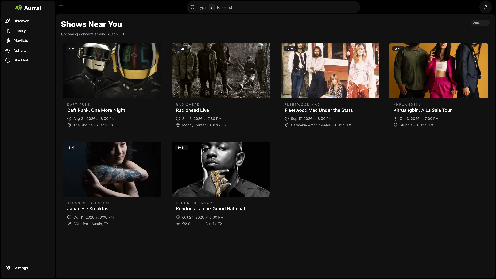

Ticketmaster is optional. When configured, Aurral surfaces nearby shows for recommended, trending, and library-adjacent artists.

## Setup

Add your Ticketmaster consumer key in **Settings → Connect → Ticketmaster**.

When you enable shows, users can set the location automatically. They can also enter a ZIP or postal code on the Discover page.
