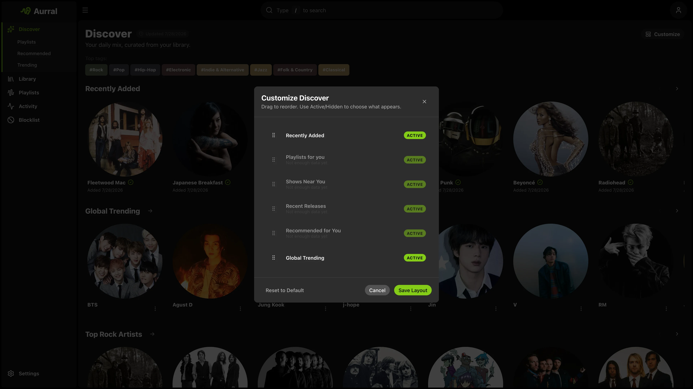

Discover is Aurral's home screen. It shows personalized recommendations, global trends, tags, recent releases, discover playlists, and recently added artists.

When you configure Ticketmaster, Discover also shows nearby events.

Discover uses your library data. Aurral tries to recommend artists that fit your taste but are not in your library.

## What shapes recommendations

- Your Lidarr library
- Your Last.fm, ListenBrainz, or Koito listening history
- Last.fm tags and similar artists
- Global trending pools
- Recent releases
- Your feedback on recommendations

**More like this** and **Less like this** increase or decrease the importance of related artists. These actions do not permanently exclude artists.

**Block artist** permanently excludes an artist for one user. Aurral removes blocked artists from recommendations, playlist previews, and future downloads.

Manage the list from **Blocklist** in the sidebar.

## Discovery modes

| Mode     | Best for                                                  |
| -------- | --------------------------------------------------------- |
| Safer    | Familiar, high-confidence recommendations                 |
| Balanced | A mix of familiar picks and exploration                   |
| Deeper   | More adventurous recommendations outside the obvious lane |

You can customize which sections appear on your Discover page and reorder them per user.

## Discover playlists

Aurral can generate playlists such as Release Radar from your listening context. These playlists appear in Discover.

You can add them to your Playlists library for downloads and playback.

## Per-user listening history

Each user sets their own listening-history provider in **Profile** — a Last.fm or ListenBrainz username, or a Koito instance URL. This keeps recommendations personal, even on a shared instance.

## Shows

When you configure Ticketmaster, Discover can show nearby events for recommended, trending, and library-adjacent artists.
