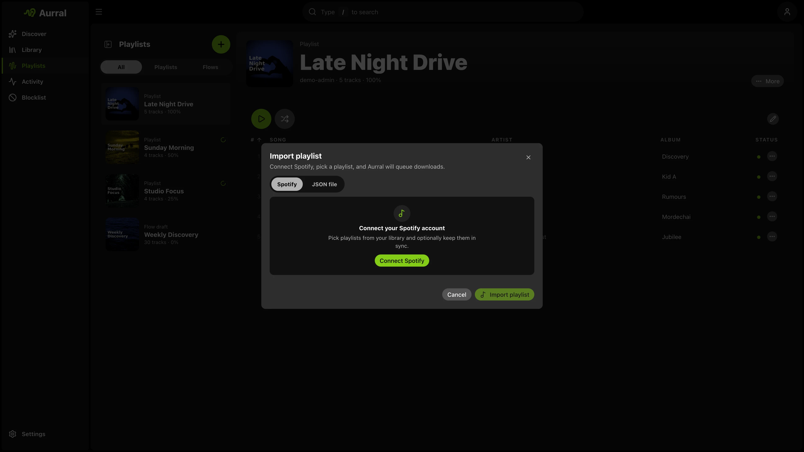

Imported playlists are separate from flows.

- They do not regenerate on a schedule.
- They do not use source mix, focus filters, or deep dive.
- They keep the exact imported tracklist.
- They can reuse completed Aurral tracks or existing Lidarr files when worker settings allow.



## Spotify import

The fastest path is in-app import on **Playlists**.

1. Open the create menu and choose **Import playlist**.
2. Select **Spotify**, then **Connect Spotify**.
3. Approve access in the popup, pick a playlist, and import.

During import you can set a display name and a sync schedule. Sync re-fetches the Spotify tracklist and queues new tracks. Choose **None** for a fixed snapshot. Change sync later from the playlist menu.

Aurral stores the connection for each user. Use **Disconnect** in the import modal to revoke access.

Allow the OAuth popup if your browser blocks it. Self-hosted instances need `oauth.html` reachable on the same origin Aurral serves.

### Manual CSV import

When OAuth is not an option, use the [Spotify import helper](https://aurral.org/aurral-convert.html) or Exportify plus CSVJSON:

1. Export from [Exportify](https://exportify.net/)
2. Convert with [CSVJSON](https://csvjson.com/csv2json) or aurral-convert.html
3. Import the JSON on the **JSON file** tab in the import modal

Aurral accepts CSVJSON output directly and understands Spotify-style keys like `Track Name`, `Artist Name(s)`, and `Album Name`.

## What the importer accepts

The importer accepts these JSON shapes:

1. An exported Aurral playlist file
2. A single playlist object with a `tracks` array
3. A raw array of tracks
4. A bundle object with a `playlists` array
5. A nested `{ "playlist": { ... } }` wrapper

## Required track fields

Each track must include:

- `artistName`
- `trackName`

Accepted aliases:

| Field                | Accepted keys                                           |
| -------------------- | ------------------------------------------------------- |
| Artist               | `artistName`, `artist`, `artist_name`, `Artist Name(s)` |
| Track                | `trackName`, `title`, `name`, `track`, `Track Name`     |
| Album (optional)     | `albumName`, `album`, `Album Name`                      |
| Artist ID (optional) | `artistMbid`, `artistId`, `mbid`                        |

Minimum shape:

```json
{
  "artistName": "Burial",
  "trackName": "Archangel"
}
```

## Accepted JSON examples

### Exported Aurral playlist file

```json
{
  "type": "aurral-static-tracklist",
  "version": 1,
  "exportedAt": "2026-03-25T12:00:00.000Z",
  "name": "Late Night Finds",
  "sourceName": "Friday Flow",
  "sourceFlowId": "abc123",
  "trackCount": 2,
  "tracks": [
    {
      "artistName": "Burial",
      "trackName": "Archangel",
      "albumName": "Untrue",
      "artistMbid": null
    },
    {
      "artistName": "Four Tet",
      "trackName": "Two Thousand and Seventeen",
      "albumName": null,
      "artistMbid": null
    }
  ]
}
```

### Single playlist object

```json
{
  "name": "My Playlist",
  "tracks": [
    { "artistName": "Massive Attack", "trackName": "Teardrop" },
    { "artistName": "Portishead", "trackName": "Roads" }
  ]
}
```

### Raw array of tracks

Aurral treats a top-level array of track objects as one playlist. The CSV converter generates this format.

```json
[
  { "artistName": "Burial", "trackName": "Archangel" },
  { "artistName": "Air", "trackName": "La Femme d'Argent" }
]
```

### Multi-playlist bundle

```json
{
  "playlists": [
    {
      "name": "Warm",
      "tracks": [{ "artistName": "Bonobo", "trackName": "Kiara" }]
    },
    {
      "name": "Dark",
      "tracks": [{ "artistName": "Burial", "trackName": "Near Dark" }]
    }
  ]
}
```

### Nested playlist wrapper

```json
{
  "playlist": {
    "name": "Imported Set",
    "tracks": [{ "artistName": "Air", "trackName": "La Femme d'Argent" }]
  }
}
```

## Import notes

- Aurral treats a top-level array of track objects as one playlist.
- Aurral treats a top-level array of playlist objects as multiple playlists.
- If an imported playlist name conflicts with an existing playlist, Aurral renames it automatically.
- Imported playlists queue their own downloads and do not affect any flow configuration.
- When existing file reuse succeeds, Aurral immediately marks the imported track as complete.

## Download retries and failure behavior

Imported playlists behave differently from flows when downloads fail:

- Aurral queues each imported track as a separate worker job.
- The active download pipeline can try multiple candidates and configured sources.
- After Aurral exhausts those options, the track stays in the failed state across worker and container restarts.
- Choose **Re-search missing** from the playlist menu to explicitly queue failed tracks again.
- Only flows can generate replacement tracks.

## Existing file reuse

Aurral reuses one file across playlists instead of downloading again. Add a flow find to a static playlist and both point at the same file until the flow refreshes. On refresh, Aurral moves still-referenced files into the static playlist before wiping the flow folder, then builds the new flow.

Aurral prefers static playlists and Lidarr when both exist. Multiple playlists can share one path.

Before Aurral removes a playlist, it relocates the remaining references. Thus, Navidrome does not show duplicates.

Lidarr-aware reuse requires Aurral to read the files at the paths Lidarr reports. Match Lidarr's media mount (for example `/data:/data` with root `/data/music`). See [Match Lidarr](/getting-started/storage/).

If Lidarr runs on Windows and Aurral runs in Docker, run **Test library access** in **Settings → Lidarr**.

Use the reported path to add a mapping under **Settings → Download Clients → Remote Path Mappings**.

If Navidrome uses a different path for reused Lidarr files, enable **Use Navidrome paths in M3U files**.

Add a Navidrome path mapping so `.m3u` files use paths that Navidrome can open. See [Navidrome](/integrations/navidrome/#mixed-windows-and-docker-navidrome).
